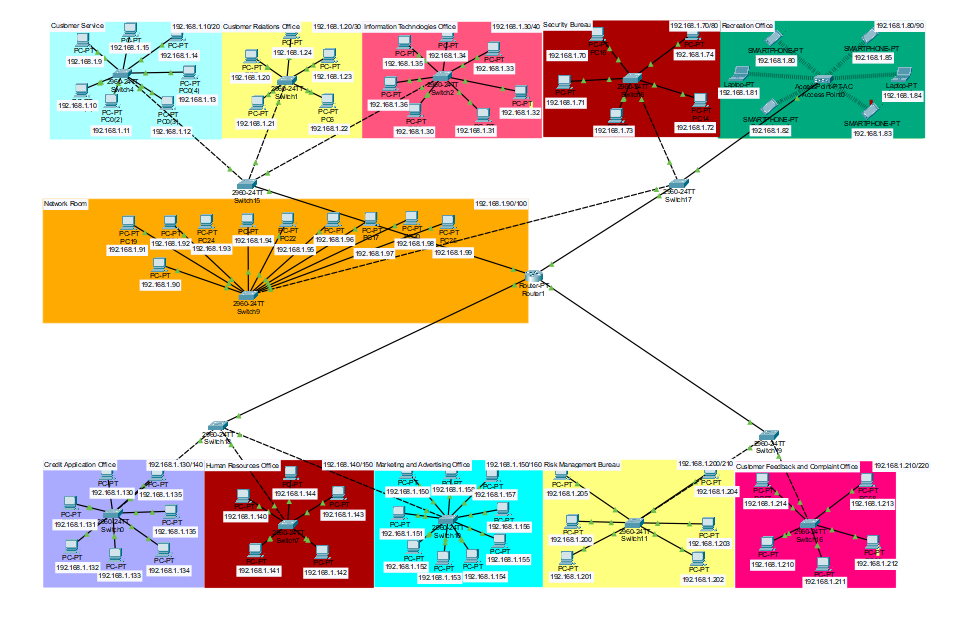

# State Building Security and Performance Management
 The "State Building Security and Performance Management" project ensures seamless connectivity and security for ten departments in one network room. Utilizing Cisco Packet Tracer, switches, routers, and access points are strategically deployed. VLANs enhance security, OSPF manages traffic, and access points offer secure wireless connections. Robust security measures like firewalls and IDS are in place, while performance monitoring tools ensure optimal network operation.

